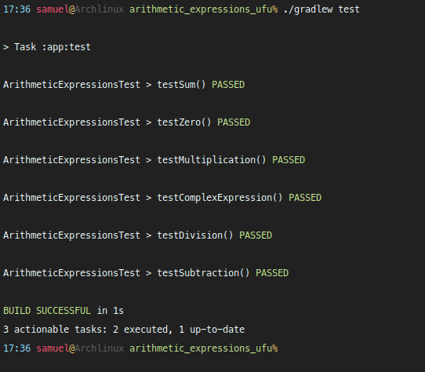

# Composite

## enunciado
conclua o exemplo sobre expressões aritméticas aplicando o
Composite e principalmente mostrando o cálculo das expressões.
Mostre o resultado para as expressões abaixo:

a) 0  
b) 1+2  
c) 1 * (2 + 3)  
d) (2* 3) + (4 /  (5 - 3))  

## Resposta
Para cada expressão foi feita um teste automatizado:

```java
//ArithmeticExpressionsTest.java
 @Test
    public void testZero() {
        assertEquals(0, new Number(0).reduce());
    }

    @Test
    public void testSum() {
        int one = 1;
        int two = 2;

        int expected = one + two;

        Expression a = new Number(one);
        Expression b = new Number(two);
        Expression sum = new Addition(a, b);
        assertEquals(expected, sum.reduce());
    }

    @Test
    public void testMultiplication() {
        int one = 1;
        int two = 2;
        int three = 3;
        int five = 5;


        Expression a = new Multiplication(new Number(five), new Number(three));
        assertEquals(five * three, a.reduce());

        Expression sum = new Addition(new Number(two), new Number(three));

        assertEquals(five * one, new Multiplication(sum, new Number(one)).reduce());
        assertEquals(five * three, new Multiplication(sum, new Number(three)).reduce());

    }

    @Test
    public void testDivision() {
        int two = 2;
        int three = 3;
        int four = 4;
        int five = 5;

        Expression division = new Division(new Number(four), new Number(two));

        assertEquals(two, division.reduce());

        division = new Division(new Number(five), new Number(three));

        assertEquals(five / three, division.reduce());
    }


    @Test
    public void testSubtraction() {
        int two = 2;
        int one = 1;

        Expression substraction = new Subtraction(new Number(two), new Number(one));

        assertEquals(two - one, substraction.reduce());


        substraction = new Subtraction(new Number(one), new Number(two));

        assertEquals(one - two, substraction.reduce());
    }

    @Test
    public void testComplexExpression() {

        int two = 2;
        int three = 3;
        int four = 4;
        int five = 5;
        Expression multi = new Multiplication(new Number(two), new Number(three));

        Expression sub = new Subtraction(new Number(five), new Number(three));

        Expression division = new Division(new Number(four), sub);

        Expression sum = new Addition(multi, division);

        assertEquals((2 * 3) + (4 / (5 - 3)), sum.reduce());
    }
```

Você pode executar os testes com o comando:
```shell
./gradlew test
```

### Saida Esperada
